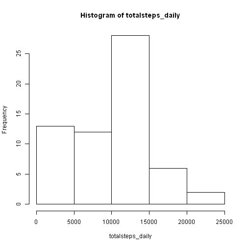

# Reproducible Research: Peer Assessment 1


## Loading and preprocessing the data

### Load the data (i.e. read.csv())

```r
setwd("E:\\study\\MOOC\\JH_MOOC\\ReproducibleResearch\\Assignment1")
activity <- read.csv("activity.csv")
```


### Process/transform the data (if necessary) into a format suitable for your analysis


```r
# calculate the total number of steps taken each day
totalsteps_daily <- with(activity, tapply(steps, date, sum, na.rm = TRUE))
```


```r
# calculate the average number of steps taken each 5-minute interval
avgsteps_interval <- with(activity, tapply(steps, interval, mean, na.rm = TRUE))
```


## What is mean total number of steps taken per day?

### Make a histogram of the total number of steps taken each day

```r
hist(totalsteps_daily)
```

 


### Calculate and report the mean and median total number of steps taken per day
  * Mean is 9354.2295
  * Median is 10395

## What is the average daily activity pattern?

### Make a time series plot (i.e. type = "l") of the 5-minute interval (x-axis) and the average number of steps taken, averaged across all days (y-axis)


```r
plot(avgsteps_interval ~ names(avgsteps_interval), type = "l", xlab = "interval", 
    ylab = "average steps")
```

 


### Which 5-minute interval, on average across all the days in the dataset, contains the maximum number of steps?

    The interval 835 contains the maximum number of steps

## Imputing missing values

### Calculate and report the total number of missing values in the dataset (i.e. the total number of rows with NAs)

   There are 2304 rows with missing values

### Devise a strategy for filling in all of the missing values in the dataset. The strategy does not need to be sophisticated. For example, you could use the mean/median for that day, or the mean for that 5-minute interval, etc.

  Strategy: Using the mean for that 5-minute interval to fill in the missing values.

### Create a new dataset that is equal to the original dataset but with the missing data filled in.


```r
na_rows <- is.na(activity$steps)
activity_filled <- activity
activity_filled$steps[na_rows] <- avgsteps_interval[as.character(activity$interval[na_rows])]
```


### Make a histogram of the total number of steps taken each day and Calculate and report the mean and median total number of steps taken per day. Do these values differ from the estimates from the first part of the assignment? What is the impact of imputing missing data on the estimates of the total daily number of steps?

   * histogram

```r
totalsteps_daily_filled <- with(activity_filled, tapply(steps, date, sum))
hist(totalsteps_daily_filled)
```

 


   * After filling, the mean and median of steps taken per day 
   * Mean: 1.0766 &times; 10<sup>4</sup>
   * Median: 1.0766 &times; 10<sup>4</sup>
   
## Are there differences in activity patterns between weekdays and weekends?

### Create a new factor variable in the dataset with two levels ¨C ¡°weekday¡± and ¡°weekend¡± indicating whether a given date is a weekday or weekend day.


```r
require(chron)
```

```
## Loading required package: chron
```

```r
weekday <- ifelse(is.weekend(as.Date(activity_filled$date)), "weekday", "weekend")
activity_weekday <- cbind(activity_filled, weekday)
```


### Make a panel plot containing a time series plot (i.e. type = "l") of the 5-minute interval (x-axis) and the average number of steps taken, averaged across all weekday days or weekend days (y-axis).


```r
# calculate the average steps over each interval-weekday/weekend
require(sqldf)
```

```
## Loading required package: sqldf
## Loading required package: gsubfn
## Loading required package: proto
## Loading required package: RSQLite
## Loading required package: DBI
## Loading required package: RSQLite.extfuns
```

```r
avgsteps_int_week <- sqldf("select interval, weekday, avg(steps) as avg_step from activity_weekday group by interval, weekday")
```

```
## Loading required package: tcltk
```

```r

# plot
require(lattice)
```

```
## Loading required package: lattice
```

```r
xyplot(avg_step ~ interval | weekday, type = "l", data = avgsteps_int_week, 
    layout = c(1, 2))
```

 


